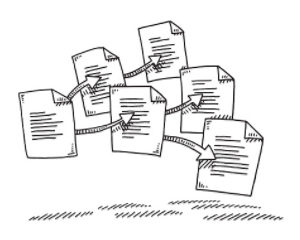
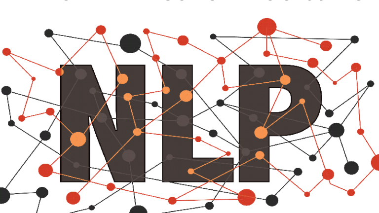
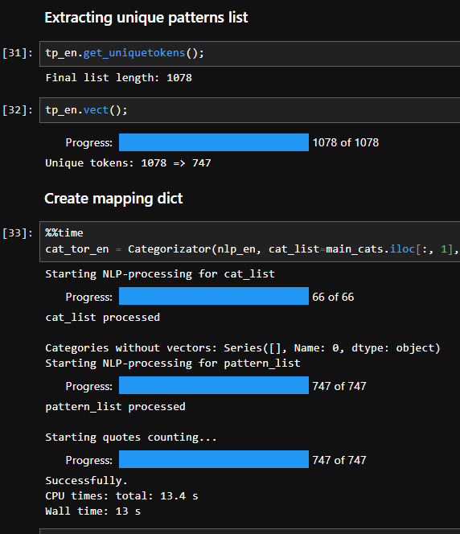
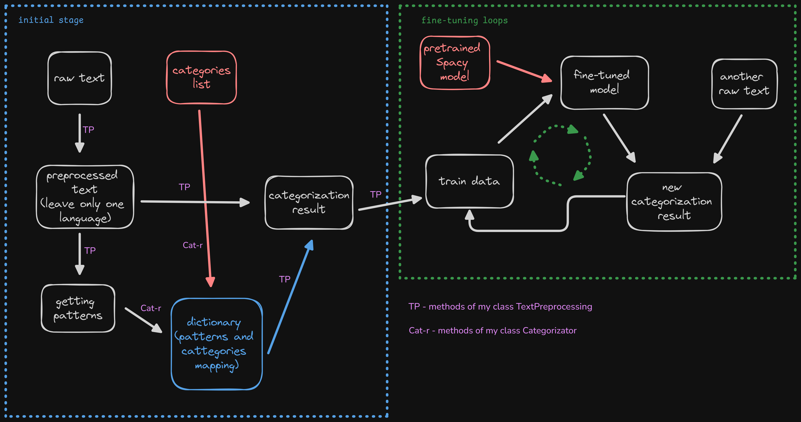
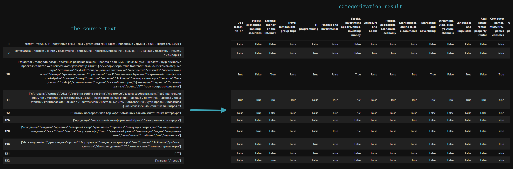
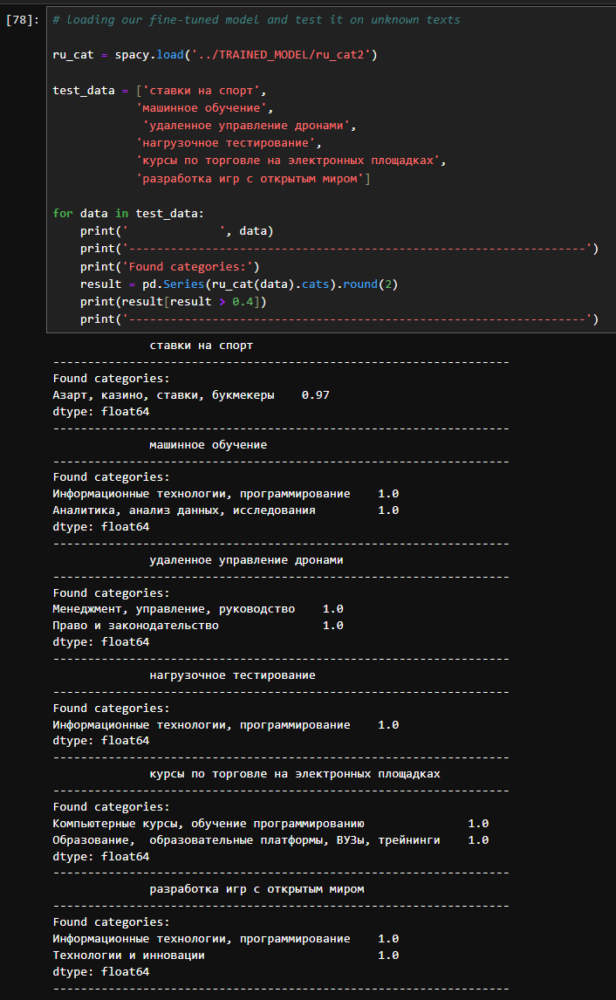
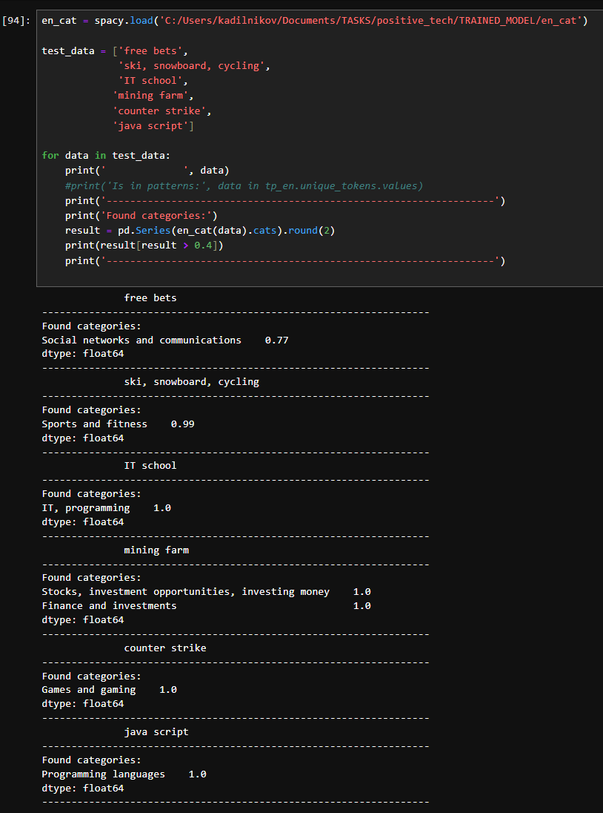
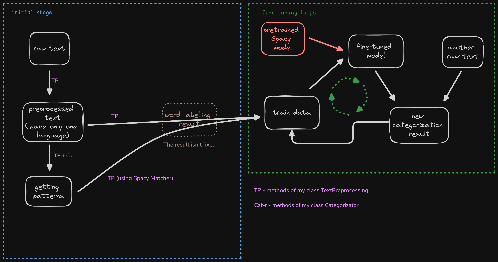
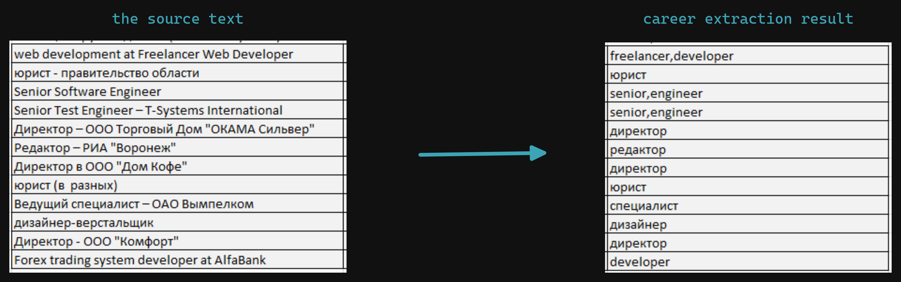
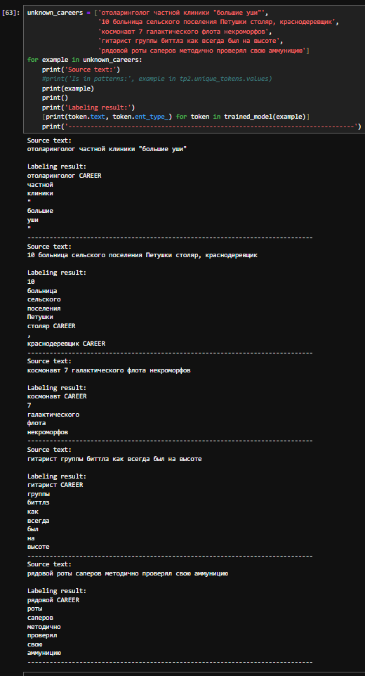

## Text Categorization & Information Extraction  

In this project I solved two major tasks:  

<a name="1">1. *Text categorization* - I have a predefined categories list and I need to determine which categories from this list the text belong to. One text can belong to many categories, so it's a kind of multiclassification task. The set of texts for this task contains information about interests of clients, but not only.  
</a>  
<a name="2">2. *Information extraction* - I have a column with the texts relative to career information. My task is to extract words that means professions from this texts. I can divide this task on two:
    * words labeling
    * words extraction according to that label
</a>  

Besides, using the results obtained I need to build the model which will detect the objects of two tasks listed above.

I write the [module](./nk_nlp1_5.py) `nk_nlp1_5` in Python to make NLP-processing of texts more comfortable and automatic and, also, to implement some ideas of this processing.  

This module contains two classes: 

`TextPreprocessing` - this class has several methods which helps to process texts using such operations like: regular expressions, deduplication, mapping, quoting and NLP-methods based on semantic similarity, finding part-of-speech and sentence dependences, named entity recognition and allows applying these methods to the collection of texts directly

`Categorizator` - the class whose methods can identify dependencies between a sets of texts. It supports several approaches to the similarity calculation which can be specified by the special parameters. In addition to the similarity the methods allows you to calculate quoting - how often this word or expression occurs in the other set of texts. This can help you to concentrate your attention on the most significant objects.

All the time-consuming processes of the methods work are eqipped with progress indicators.  

See help(classname) for details.

Using features of my [module](./nk_nlp1_5.py) I implemented pipelines to solve the tasks facing me:

---

*Text categorization task pipeline* [(1)](#1)

So I preprocessed texts, categorized them using the patterns and NLP-methods, prepared learning data and fine-tuned the pretrained Spacy model for English and Russian language to categorize texts.

*Categorization results*

*Categorization results of new texts*  

Considering, that the texts used for training the models have the similar structure, model excellently detects them and makes errors on the texts with a distinct structure.

---

*Information extraction task pipeline* [(2)](#2)

The pipeline above is similar to the previous pipeline, but it based on the work with words instead of whole texts. And we don't need a category list here.

*Career extraction results*

*Categorization results of new texts*  

This examples show how models detect and label unknown words related to professions. 
As we can see the generalization of the models is quite good.  

So this models are very good for this certain task, but if you want to use it for other texts, you should fine-tune it with additional examples.

See [notebook](./project_notebook.ipynb) for details.  

`nk_nlp1_5` [module's code](./nk_nlp1_5.py) 

