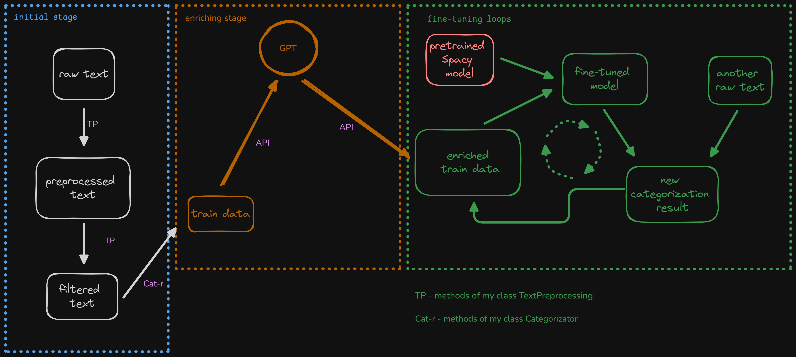

## Spam detection using NLP

This project consisted of two tasks:  

1) to find spam-messages in the set of texts I received from the client and remove them  

2) to build the model which will be able to detect spam-messages

To solve these tasks I used pretrained [Spacy](https://spacy.io/) model for Russian language and [my own module](./nk_nlp1_5.py) in Python `nk_nlp1_5`  

My module contains two classes:  

`TextPreprocessing` - this class has several methods which helps to process texts using such operations like: regular expressions, deduplication, mapping, quoting and NLP-methods based on semantic similarity, finding part-of-speech and sentence dependences, named entity recognition and allows applying these methods to the collection of texts directly  

`Categorizator` - the class whose methods can identify dependencies between a sets of texts. It supports several approaches to the similarity calculation which can be specified by the special parameters. In addition to the similarity the methods allows you to calculate quoting - how often this word or expression occurs in the other set of texts. This can help you to concentrate your attention on the most significant objects.

See help(classname) for details.

The pipeline of all the process looks so:
  

After loading and preprocessing the source data, I used my class `TextPreprocessing` for data processing.  
Method `.word_extractor` is used to remain the specified number of the words, which are closest to the set of words or phrases given as argument `pattern`. 

Then I used another my class `Categorizator`, which helps to categorize text data by the similarity. The method `cat_sim` calculates similarity between the specified phrase and text_data and sorts them by descending the similarity.  

This way almost all spam got located in the top of the table and it helped me to label this data easily and prepare the training dataset.  
To estimate this labeling I calculated some metrics:
| Metric | Value |
|:--|----:|
| Accuracy| 98.7% |
| F1 | 80.9% |

Quite a good metrics, but not perfect.  

Next I used the special method `get_train_data` of the class TextPreprocessing to prepare train data.  
For the model training I took pretrained Spacy model for Russian language and fine-tuned it using obtained train data.  
After this I tested the fine-tuned model both source and new data. As the new data I used a set of the generated texts which are very similar to the source texts, but the model had never seen them before.
|Type of Test Data| Metric | Value |
|:---|:--|----:|
|Source| Accuracy| 99.5% |
|Source| F1 | 93.8% |
|New | Accuracy |66.3%   |

