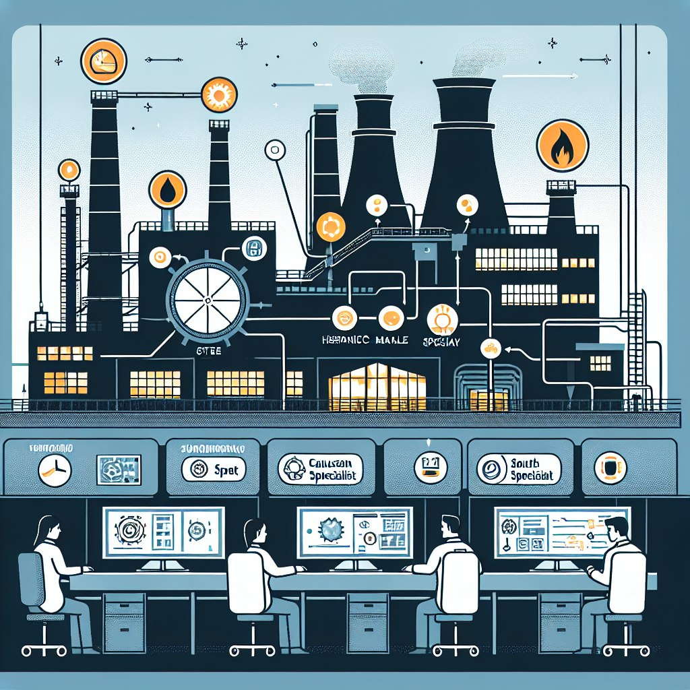
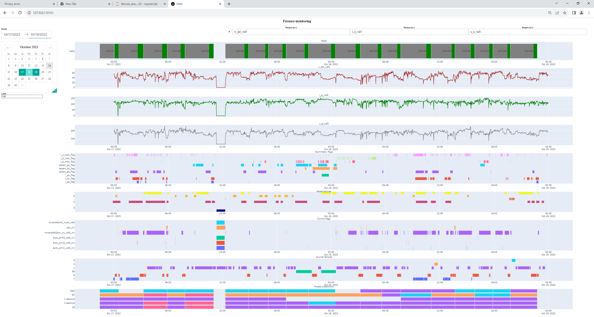
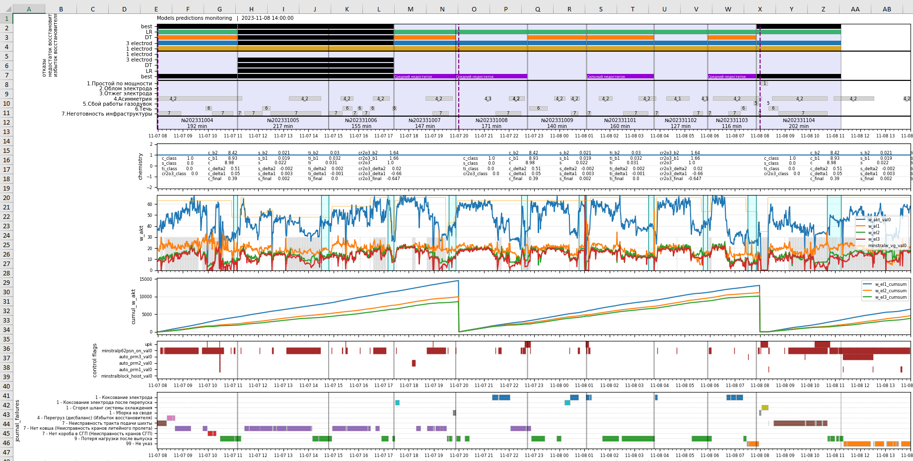

## Blast furnace monitoring

  
This project was big and long. It included many tasks: ETL, data processing and analysing, training and testing models, visualization of processes and results.  

The main purpose of this project was to create a digital advisor for the blast furnace which will help employees to control and manage the furnace.  

I participated in all stages of this project and solved different tasks, the main part of which I can't publish, but here I want to show several examples of the visualization I have done.  
  
  
1. The first example is the dashboard which I deployed on the server to control and analysis a work of the furnace: condition check and fault detection.
Building this report based on data from the database, which aggregates data from different systems in the furnace infrastructure.  
I used `psycops2` library and SQL to get data needed from the database.  
For the dashboard creation I used `plotly` and `dash` libraries, which give enough opportunities for such tasks.  

Dashboard example

  

See [the code](./furnace_process_dashboard.ipynb) of this dashboard  

2. The second example is about testing models. We trained several different models and tested them in real conditions.
The models predicted a furnace condition and we needed to compare it with the real situation. 
I had to take data from database, create the report and save it into Excel file. And it was a daily task. So I wrote the script which did everything automatically.  

Daily report example

  

See [the code](./models_prediction_testing (vizualization).py) of the script  
