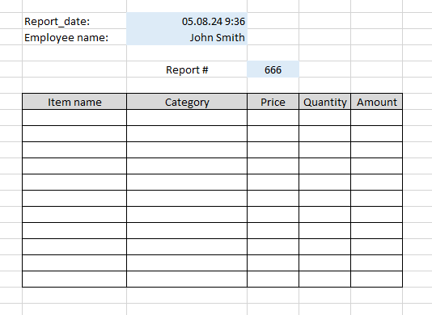

## Excel Writer

Despite the creation a plenty of advanced analytic software, which have many different options for consolidation, processing, analysis and visualization of data, Microsoft Excel is one of most popular data tools.  

The one of its main advantage is its widespread. If you save a report in Excel standart and send it, with great probability your recipient can open it in their computers.  
Excel is simple and doesn't require special skills. Many companies still use Excel reports as the main data analysis tool.
For example, you are an experienced data analyst and can use diffirent advanced data analysis tools. You can build a report or a dashboard using special software, but you should be sure that your boss or colleagues have this special software and they know how to use it(how to open your report as minimum). In the case with external partners the probability that they have this software tends to zero.

So Excel format is still popular, and if you work as data analyst and use Python like me you can get the tasks where you need to save Excel reports from Python.  

Often, for building Excel report you only need to save a simple plain table in '.xlsx' file, but not always.  
Sometimes, you need to build more complex report which contains several tables with different lengths and format on one or many sheets. For this, you need to put data in the specified places of the sheet and to format them in style needed.  
Moreover, a structure of the target report can be approved in a company. For example, the report must contain a report creation date, a name of the responsible employee, a number of report in the report title, etc.  
<figure align="center">
    
    <figcaption>The simple report example</figcaption>
</figure>
If the building of such reports is one-time task you can bring together and format data manually. You can save data to Excel file as a simple plain table and edit this file by Excel tools. Or if you are good in Python you can write the script which will add the necessary information to plain table and save the final Excel file.     
  

But in case of regular reports building this task can evolve into laborious routine, that in its turn significally increases a risk of manual work errors.  
To automate this task and to minimize manual work risks I developed a special python module `excel_report_creator` that can help to build as complex Excel report as you need.

The module uses a special Excel file - template which contains a structure and format of the future report. The template should be written using not complicated rules according to the tutorial.  
<figure align="center">
    
    <figcaption>The template example</figcaption>
</figure>

Then we should use a class ReportCreator from the module `excel_report_creator` to create a report. During the class initialization we need to put into it two parameters: *template_path* and *report_path*.  

`ec = ReportCreator(template_path='./template.xlsx', report_path='./report.xlsx')`  

Then the method *.write* helps to build and save a report to disk. This method takes two parameters: *variables* and *tables*, so we should put prepared data into the class instance using these two parameters.  

`ec.write(variables=dict_with_variables, tables=list_of_tables)`  

A template contains links to these *variables* and *tables* written according to certain rules, this way ReportCreator understands what and where to write.
After applying the 'write' method you can find the result in the specified path.

<figure align="center">
    
    <figcaption>The result for the template presented above</figcaption>
</figure>

Using `ReportCreator` you can build a complex report consists of data from different tables and variables, for example, this:  

<figure align="center">
    
    <figcaption>The complex report example</figcaption>
</figure>

You can see the whole Jupyter notebook of this practical example with my comments here.

You can also see the code of my module `excel_report_creator` here. 

