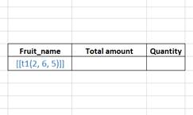

## Template creation tutorial

A template is used to define locations of report elements, their styles and formatting and consist of reports headers and special anchors. These anchors have the certain syntax and are divided into 3 categories:

**1. simple variables** - this type of anchors is used to substitute the values of simple variables to a report. Variables can have different types: string, int, float, datetime, even list or dict.
    
*Syntax:*  
`%%simple_var_name%%`
      
All types of source variables are transformed to *string* type and substitute into the given place of the string in the cell. If the string in the cell has several simple variables, all of them will be handled. The name between symbols `%%` is used for matching.

*Examples:*  

  

As we can see on this picture the given variables:
```
report_number = 777
report_date = 29.03.2024
```
are substituting into corresponding places of the string.

**2. arrays** – this type of anchors is used to substitute the values of the array into the cells, starting from the given cell and moving into the specified direction.
It can work both with 1D –arrays and with 2D-arrays.
Datatype, style, format in the finally written array are defined by ones from the template anchor cell.
    
*Syntax:*  
```
for 1D-arrays: [[t1.col_name/rcius*]]
for 2D-arrays: [[t4(3:6)/rcius*]]
for 2D-arrays: [[t5(2, 4, 5)/rcius*]]
for 2D-arrays: [[t6(col_name3, col_name5, col_name8)/rcius*]]
```

`tn` – where n - the specified table number from the set of tables. You can use one or more data tables to build a report.  
`col_name` - the specified column name of the table defined by the table_name  
`(3:6)` – the slice of the table defined by the table_name (2D-array)  
`r` or `c` or nothing – the orientation of the writing direction.  
`r` – means that the script will write cells in the vertical direction  
`c` – means that the script will write cells in the horizontal direction  
the lack of these keys means using the default mode which is `r`  
`i` – means *insert cells*. This mode adds cells after writing and let avoid erasing following data  
`u` – means *update cells*. This is the default mode when the script simply writes data in the specified direction.  
`*` - means that if the written array has two or more equal values located steadily, these values will be merged in one total cell.  
`s` – means step of writing. We should put a number after the letter `s` to specify a step. It looks like `sn` *(s2, s5, s12)*, where `n` – a size of the step.  

*Examples:*  

Source data (table1):  


Example 1:


  The data from the table1 substitutes into the template using the column names mapping.
      
Example 2:

  

Using the key `c` affords changing data representation in the horizontal direction.
We also need to insert columns not to rewrite the right column with the labels. We use the mode “insert” and the anchor `i` in the template.

Example 3:  

  
Using a slice in the template affords to pass to the script two columns at once, but we can’t specify styles for these columns separately in this case. 

Example 4:  

 

We can use the list of the column numbers 

Example 5:  

 

or names to order them.
It works for one column number or name too.

Example 6:  


To build the report with the merged cells we should create them in the template and this merge will spread to the corresponding array. To work with the alternating values from different columns (price, quantity) we should use the special parameter `sn` where `n` – a size of the step.  

Example 7:  


 
In this example we use the step = 3 cells for the alternating values, vertical and horizontal merges and `i` parameter in the first data column to save the border cells from rewriting.

Example 8:  

  

We can build the report that contains as many different tables from different sources as we can imagine. Tables can locate either on one sheet or on many sheets. If you want to create the report that contains several sheets you should create the template with this number of sheets.


**3. pivot table** - this type of anchors is used to create and write into Excel a pivot table.
The syntax is similar to ‘array’ type, but we should put ‘pt’ characters instead of ‘t’ before a table number. 
Besides a new type of the orientation appears for pivot table – ‘v’  means ‘values’. So, you should specify as minimum three types of arrays: ‘rows’, ‘columns’ and ‘values’ to get a pivot table.

Syntax:
for 1D-arrays: [[pt2.col_name/rcviu*]]
for 2D-arrays: [[pt4(3:6)/rcviu*]]
for 2D-arrays: [[pt5(2, 4, 5)/rcviu*]]
for 2D-arrays: [[pt12(col_name3, col_name5, col_name8)/rcviu*]]

Examples:

Source data (table1):   

Example 9:

 As we can see in the picture above we built the simple pivot table that can grow either in vertical or horizontal direction if data changes.


Source data (table2): 


Example 10:
           

We can build more complex pivot tables combining data in index and columns.

Example 11:
           

If we need to add names of values into the pivot table, we should put a special anchor into a template. This anchor contains the service name ‘__VAL_NAMES__’, which messages to the script about this action.
