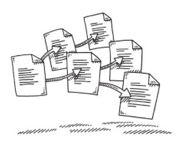
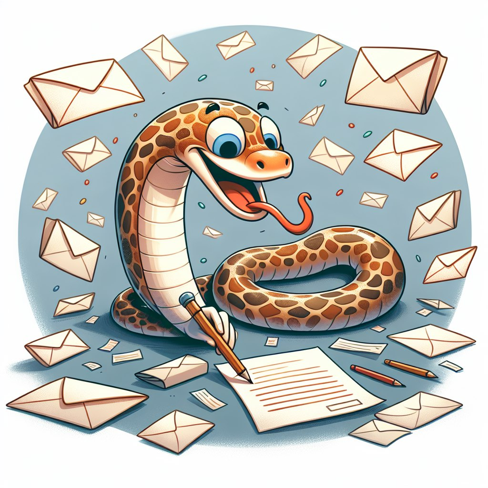

Hi!  :wave:

I am Nikolay. I work in the field of data analysis, data science and data engineering.  

I solve tasks connected with NLP, ML in general, ETL, data processing and visualization.  

I use Python, SQL and some popular frameworks to solve my tasks: SpaCy, Transformers, Scikit-learn, Tensorflow, Pandas, Matplotlib, Plotly, Dash, etc.
I also have an experience in working with LLM via API.

 To demonstrate my skills I posted descriptions of several my work projects. :computer:

---

  

### NLP Text Classification and Information Extraction

In this project I solved two major tasks:  
1. *Text categorization* - I have a predefined categories list and I need to determine which categories from this list the text belong to. One text can belong to many categories, so it's a kind of multiclassification task. The set of texts for this task contains information about interests of clients, but not only.  
2. *Information extraction* - I have a column with the texts relative to career information. My task is to extract words that means professions from this texts. I can divide this task on two:
  

    * words labeling
    * words extraction according to that label
      
Besides, using the results obtained I need to build the model which will detect the objects of two tasks listed above.

To reach these goals I used SpaCy and wrote the module in Python to make NLP-processing of texts more comfortable and automatic and to implement some ideas of this processing.

[Learn more...](./1_career&interests_extraction%20(NLP,%20Python)/readme.md)

---

### NLP Spam Detection

This project consisted of two tasks:  

1) to find spam-messages in the set of texts I received from the client and remove them  

2) to build the model which will be able to detect spam-messages

To solve these tasks I used pretrained Spacy model for Russian language and my own module in Python.  

[Learn more...](./2_spam_detector%20(NLP,%20Python)/readme.md)

---

### Models and Blast Furnace Processes Visualization
This project was big and long. It included many tasks: ETL, data processing and analysing, training and testing models, visualization of processes and results.  

The main purpose of this project was to create a digital advisor for the blast furnace which will help employees to control and manage the furnace.  

I participated in all stages of this project and solved different tasks, the main part of which I can't publish, but here I want to show several examples of the visualization I have done.

[Learn more...](./3_blastfurnace_monitoring%20(dashboard&visualization,%20Python,%20SQL)/readme.md)

---

### Automated Excel Report Writer

Despite creation a plenty of advanced analytic software, which have many different options for consolidation, processing, analysis and visualization of data, Microsoft Excel is one of the most popular data tools.  
One of its main advantages is its wide use. If you save a report in Excel standard and send it, with great probability your recipients can open it in their computers.  
 So Excel format is still popular, and if you work as data analyst and use Python like me you can get the tasks where you need to save Excel reports from Python.  

To automate this task and to minimize manual work risks, I developed a special Python module that can help to build as complex Excel report as you need.

[Learn more...](./4_excel_report_writer%20(Python)/readme.md)

---

### Python Mail Sender

If you have this kind of task, Python allows sending email messages using builtin libraries (SMTP, email, IMAP).  

To make the work with mailing list easier without deep immersion into these libraries I wrote a small module in Python.  

  

[Learn more...](./5_mail_sender%20(Python)/readme.md)

---
